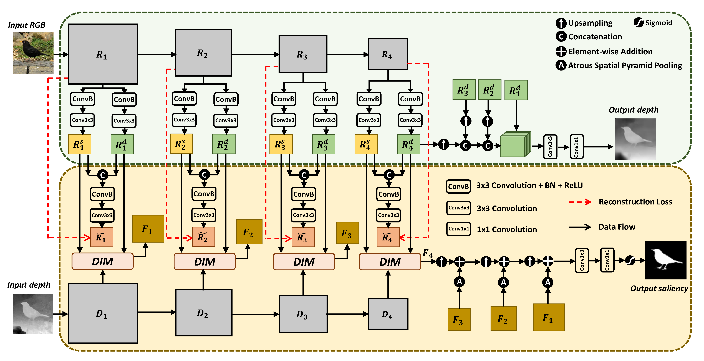

# Boosting RGB-D Saliency Detection by Leveraging Unlabeled RGB Images

- This repository is the official implementation of [the paper](https://ieeexplore.ieee.org/document/9673131).



## Our results

- comming soon in BaiduPan [link](https://github.com/Robert-xiaoqiang/DS-Net) or Google Drive [link](https://github.com/Robert-xiaoqiang/DS-Net).

## Prerequisites
```bash
pip install -r requirements.txt
```

## Datasets

- download all the benchmark datasets of RGB-D saliency from this [link](http://dpfan.net/d3netbenchmark/).
- `unzip` them into the same directory.
- adapt the `UNLABELED.*` items of `*.yaml` configure file using the above directory.
- download the unlabeled RGB datasets from the [DUTS](http://saliencydetection.net/duts/) image dataset and discard its saliency labels.

## Configure Format

- we follow the widely-used hierarchical configuration paradigm using the [YAML](https://en.wikipedia.org/wiki/YAML) (a human-readable data-serialization mark language) file format.
- run the following script to create a default configure file.
```bash
cd configure/
python default.py
```
- adapt the specific items (or entries) according to your requirements.

## Train

```bash
python source/main.py --cfg path/to/configure
```

## Test

```bash
python source/test.py --cfg path/to/configure
```

## Test without metrics computation

```bash
python source/predict.py --cfg path/to/configure
```

## Acknowledge
- thanks to the co-authors for their constructive suggestions.
- codebase is inspired by the [Mean Teacher Framework](https://github.com/CuriousAI/mean-teacher).

## License
Copyright 2021 Author of DS-Net

Permission is hereby granted, free of charge, to any person obtaining a copy of this software and associated documentation files (the "Software"), to deal in the Software without restriction, including without limitation the rights to use, copy, modify, merge, publish, distribute, sublicense, and/or sell copies of the Software, and to permit persons to whom the Software is furnished to do so, subject to the following conditions:

The above copyright notice and this permission notice shall be included in all copies or substantial portions of the Software.

THE SOFTWARE IS PROVIDED "AS IS", WITHOUT WARRANTY OF ANY KIND, EXPRESS OR IMPLIED, INCLUDING BUT NOT LIMITED TO THE WARRANTIES OF MERCHANTABILITY, FITNESS FOR A PARTICULAR PURPOSE AND NONINFRINGEMENT. IN NO EVENT SHALL THE AUTHORS OR COPYRIGHT HOLDERS BE LIABLE FOR ANY CLAIM, DAMAGES OR OTHER LIABILITY, WHETHER IN AN ACTION OF CONTRACT, TORT OR OTHERWISE, ARISING FROM, OUT OF OR IN CONNECTION WITH THE SOFTWARE OR THE USE OR OTHER DEALINGS IN THE SOFTWARE.

## Citation
```latex
@article{wang2022boosting,
  title={Boosting RGB-D Saliency Detection by Leveraging Unlabeled RGB Images},
  author={Wang, Xiaoqiang and Zhu, Lei and Tang, Siliang and Fu, Huazhu and Li, Ping and Wu, Fei and Yang, Yi and Zhuang, Yueting},
  journal={IEEE Transactions on Image Processing},
  year={2022},
  publisher={IEEE}
}
```